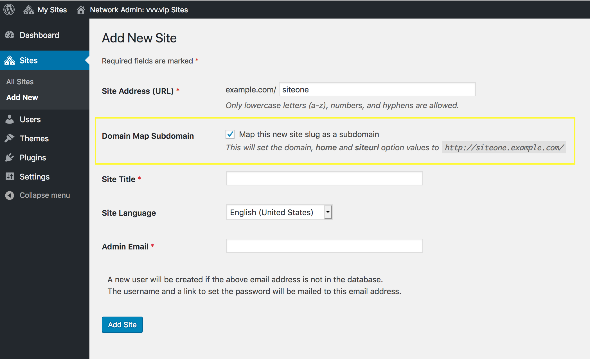

# Pseudo Subdomain Network #
**Contributors:**      davidsword  
**Donate link:**       https://wordpressfoundation.org/donate/  
**Tags:**              network, multisite, subdomain, domain map, mapping  
**Requires at least:** 5.0  
**Tested up to:**      5.1.1  
**Stable tag:**        1.0.0  
**Requires PHP:**      7.1  
**License:**           GPLv2 or later  
**License URI:**       https://www.gnu.org/licenses/gpl-2.0.html  

On a WordPress Network site, using a Subdirectories (path-based) install for sub sites, this plugin adds an option in to quickly Domain Map the Subdirectory site as a subdomain of the network.

## Description ##

On a [WordPress Network](https://codex.wordpress.org/Create_A_Network) site, using a Subdirectories (path-based) install for sub sites, this plugin adds an option in **Network » Sites » Add New Site** to quickly [Domain Map](https://wordpress.org/support/article/wordpress-multisite-domain-mapping/) the Subdirectory site as a subdomain of the network.



For example, if you create the subdirectory site `example.com/siteone/`, when the new option selected, after the form is submitted and the site created, the site will be mapped to the subdomain by:

Setting the `home` and `siteurl` values to `http://siteone.example.com`:

```
+-----------+-------------+----------------------------+----------+
| option_id | option_name | option_value               | autoload |
+-----------+-------------+----------------------------+----------+
|         2 | home        | http://siteone.example.com | yes      |
|         1 | siteurl     | http://siteone.example.com | yes      |
+-----------+-------------+----------------------------+----------+
```

And setting the `domain` column of `wp_blogs` to `siteone.example.com` and adjusting the `path` as needed:

```
+---------+---------------------+------+
| blog_id | domain              | path |
+---------+---------------------+------+
|       2 | siteone.example.com | /    |
+---------+---------------------+------+
```

_Why_? Because some hosts do not allow WordPress networks as Subdomain installs, only Subdirectories. This plugin helps create a sort of pseudo Subdomain Network, quickly mapping the new site.

These domains will only work out-of-the box if you've set wild card sub domains, or set the subdomains A records before hand. For more information please [see this page](https://codex.wordpress.org/Create_A_Network) or contact your hosting provider.

## Installation ##

The plugin should either be installed as a mu-plugin or network activated. It's a network plugin and therefore cannot be activated on individual sites on the network.

1. Ensure your site is a [WordPress Network setup](https://codex.wordpress.org/Create_A_Network)
1. The network must be a subdirectories insteall, not a subdomain install
1. Upload `/pseudo-subdomain-network/` to `/wp-content/mu-plugins/` or `/wp-content/plugins/` directory
1. If uploaded to the latter, activate the plugin through the 'Network » Plugins' menu in WordPress

## Frequently Asked Questions ##

### Is a multisite setup the same as a network? ###

Yes. The verbiage is interchangeable.

### Does this plugin work when `SUBDOMAIN_INSTALL` is true? ###

No. This plugin only works when the network is a Subdirectories install.

## Screenshots ##

### 1. The field added to the `Network » Sites » Add New Site` form. ###


## Changelog ##

### 1.0.0 ###
* **April 12, 2019**
* Init release

## Contributors ##

The following grunt tasks are available during development:

* `grunt i18n` containing `addtextdomain` and `makepot`
* `grunt readme` containing `wp_readme_to_markdown`
* `grunt` run the two commands above

For tests (on a VVV setup):

* `$ cd /path/to/pseudo-subdomain-network/`
* `$ ./bin/install-wp-tests.sh phpunit root root`
* `$ phpunit`
